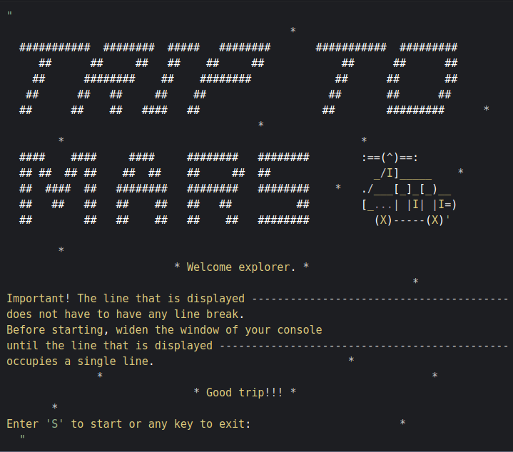
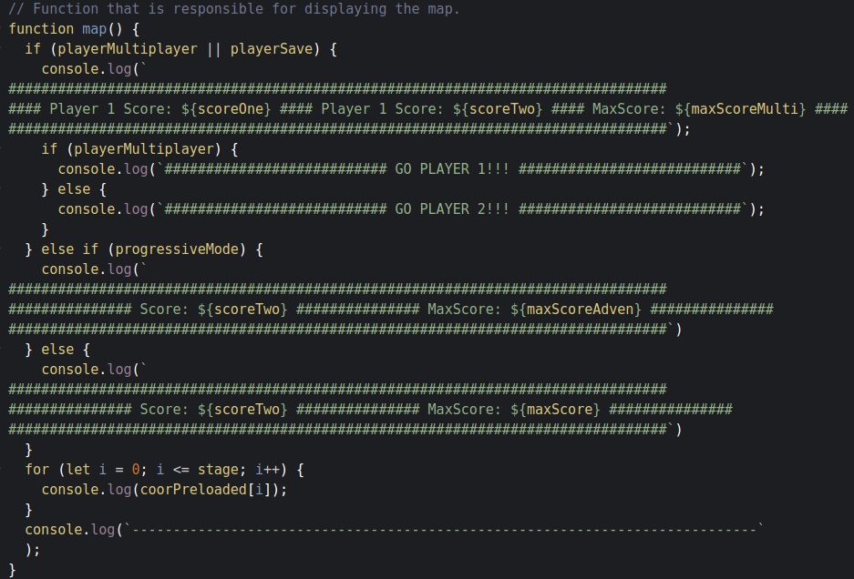
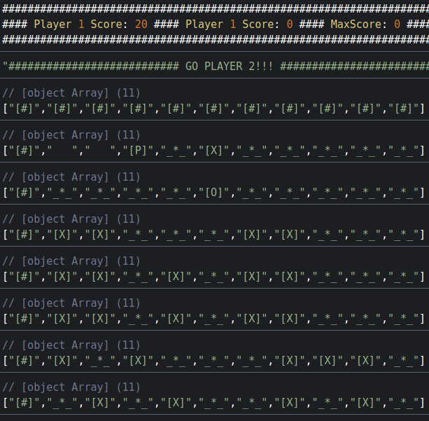
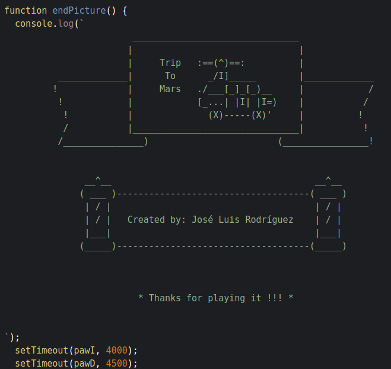

# Mars-Rover-Kata

<!-- PROJECT LOGO -->

  
   

  <!-- <h3 align="center">Infect Me</h3> -->

  

    Project-game 
     
    <a href="https://github.com/joselrdg/Mars-Rover-Kata"><strong>Explore the docs »</strong></a>
     
     
    <a href="https://codepen.io/JoselRdg/pen/vYKaPZK">View Demo</a>
    ·
    <a href="https://github.com/joselrdg/Mars-Rover-Kata/issues">Report Bug</a>
    ·
    <a href="https://github.com/joselrdg/Mars-Rover-Kata/issues">Request Feature</a>
  

<!-- ABOUT THE PROJECT -->
## About

This is a game created to give a personal touch to a kata proposed for admission to the IronHack web development bootcamp. 
It is completely written in JavaScript and I am very proud of the result since it was my first contact with the development world and the first time I wrote a line of code. 
It was developed on the codepen website and is played through the terminal. 
The game tries to drive a vehicle located on Mars, by sending commands that are translated into movement orders. You have to dodge obstacles until you reach the marked objective.
They can play one or two players and there is an adventure mode in which they will increase the size of the maps and the difficulty. In two-player mode, the one with the most points will win before either of the two players collides with an obstacle. There is also a free mode in which the rover can move as many times as desired until it reaches the objective or collides with an obstacle. .

***̣________________***  
[P]----> Player  
[X] ----> Obtacle 
[O] ----> Objective 
[*] ----> Coin 

 

<!-- Here's a blank template to get started:
**To avoid retyping too much info. Do a search and replace with your text editor for the following:**
`github_username`, `repo_name`, `twitter_handle`, `email`, `project_title`, `project_description` -->

### Built With 🛠️

* [Vanilla JavaScrips](https://developer.mozilla.org/en-US/docs/Web/JavaScript/)

<!-- ROADMAP -->
## Roadmap

See the [open issues](https://github.com/joselrdg/Mars-Rover-Kata/issues) for a list of proposed features (and known issues).

<!-- CONTRIBUTING -->
## Contributing ✒️

Contributions are what make the open source community such an amazing place to be learn, inspire, and create. Any contributions you make are **greatly appreciated**.

1. Fork the Project
2. Create your Feature Branch (`git checkout -b feature/AmazingFeature`)
3. Commit your Changes (`git commit -m 'Add some AmazingFeature'`)
4. Push to the Branch (`git push origin feature/AmazingFeature`)
5. Open a Pull Request

<!-- LICENSE -->
## License 

Distributed under the MIT License. See `LICENSE` for more information.

<!-- CONTACT -->
## Contact

José Luis Rodríguez , [josesietepicos@gmail.com](mailto:josesietepicos@gmail.com)

Project Link: [https://github.com/joselrdg/Mars-Rover-Kata](https://github.com/joselrdg/Mars-Rover-Kata)

Demo Link: [https://codepen.io/JoselRdg/pen/vYKaPZK](https://codepen.io/JoselRdg/pen/vYKaPZK)
